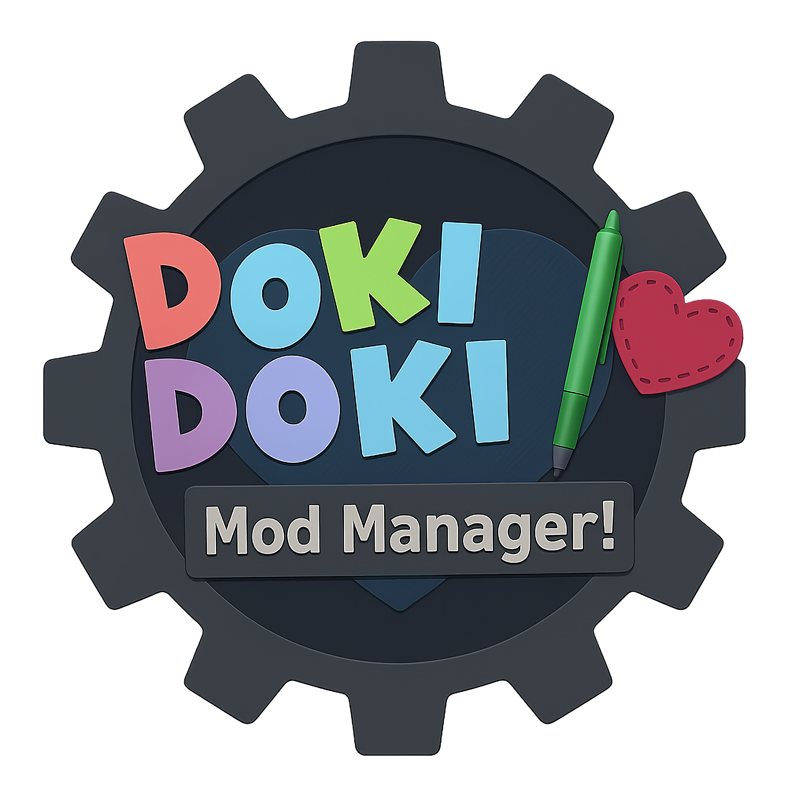

<div align="center">
  
  
  
  # 🎀 Doki Doki Mod Manager 🎀
  
  <h3>✨ The ultimate mod manager for Doki Doki Literature Club! ✨</h3>
  
  <p>
    <a href="https://github.com/Dynamicaaa/Mod-Manager/releases">
      
    </a>
    <a href="LICENSE">
      
    </a>
  </p>
  
  <p>
    <a href="https://github.com/Dynamicaaa/Mod-Manager/releases">
      
    </a>
  </p>
  
  <p>
    <a href="https://github.com/Dynamicaaa/Mod-Manager/stargazers">
      
    </a>
    <a href="https://github.com/Dynamicaaa/Mod-Manager/forks">
      
    </a>
  </p>
  
  <br>
  
  <h4>🌟 Modern, feature-rich mod management with integrated Sayonika store support 🌟</h4>
  
  <br>
  
  <p><strong>👨‍💻 Maintainer:</strong> <a href="https://github.com/Dynamicaaa">Dynamicaaa</a></p>
  
  <br>
  
</div>

<div align="center">

## ✨ Features

<br>

</div>

<table style="margin: 0 auto; border-collapse: collapse; width: 90%; max-width: 800px; margin-left: auto; margin-right: auto; display: table;">
<tr>
<td style="text-align: center; padding: 12px; border: 1px solid #ddd;">

### 🌟 **Core Features**

<div align="left">

- 🎯 **Integrated Sayonika Store** - Browse and download mods directly
- 📦 **Smart Mod Management** - Install, organize, and launch with ease
- 🔐 **Multiple Authentication** - GitHub or email/password login
- 🖥️ **Cross-Platform Support** - Windows, macOS, and Linux
- 🎨 **Modern Interface** - Clean, responsive DDLC-themed design

</div>

</td>
<td style="text-align: center; padding: 12px; border: 1px solid #ddd;">

### 🚀 **Advanced Features**

<div align="left">

- 🔍 **Powerful Search** - Find mods quickly with filters
- ⭐ **Ratings & Reviews** - Community-driven mod discovery
- 🏷️ **Category Filtering** - Browse by genre and tags
- 📱 **One-Click Install** - Seamless mod installation
- 👤 **User Profiles** - Personalized mod collections

</div>

</td>
</tr>
</table>

<div align="center">

---

</div>

<div align="center">

## 🤔 Why This Mod Manager?

</div>

<div align="center">

### 📉 **The State of DDLC Mod Management**

</div>

The original [**Doki Doki Mod Manager by proudust**](https://github.com/proudust/ddmm) was once the go-to solution for managing DDLC mods. However, it has been **abandoned and is no longer maintained**. Over time, the original DDMM has developed several critical issues:

<div align="center">

| ❌ **Issues with Original DDMM** |
|:--------------------------------:|
| **Broken functionality** due to outdated dependencies and security vulnerabilities |
| **No support for modern DDLC mods** and newer mod formats |
| **Compatibility issues** with current operating systems |
| **Lack of updates** since the project was abandoned by its maintainer |
| **Security risks** from unpatched vulnerabilities in its outdated codebase |

</div>

<div align="center">

### 🆚 **Why Not Doki Doki Mod Docker?**

</div>

While [Doki Doki Mod Docker](https://github.com/Bronya-Rand/DDModDocker) exists as an alternative, this Doki Doki Mod Manager offers significant advantages:

<div align="center">

<table style="margin: 0 auto; border-collapse: collapse; width: 90%; max-width: 800px; margin-left: auto; margin-right: auto; display: table;">
<tr>
<th style="text-align: center; padding: 12px; border: 1px solid #ddd; background-color: #f8f9fa; font-weight: bold;">🏆 <strong>This Mod Manager</strong></th>
<th style="text-align: center; padding: 12px; border: 1px solid #ddd; background-color: #f8f9fa; font-weight: bold;">🐳 <strong>Docker Version</strong></th>
</tr>
<tr>
<td style="text-align: center; padding: 12px; border: 1px solid #ddd;">✅ <strong>Native Performance</strong><br/><em>Runs directly on your system</em></td>
<td style="text-align: center; padding: 12px; border: 1px solid #ddd;">❌ <strong>Containerization Overhead</strong><br/><em>Slower due to Docker layers</em></td>
</tr>
<tr>
<td style="text-align: center; padding: 12px; border: 1px solid #ddd;">✅ <strong>Simple Installation</strong><br/><em>Download and run executable</em></td>
<td style="text-align: center; padding: 12px; border: 1px solid #ddd;">❌ <strong>Complex Setup</strong><br/><em>Requires Docker knowledge</em></td>
</tr>
<tr>
<td style="text-align: center; padding: 12px; border: 1px solid #ddd;">✅ <strong>OS Integration</strong><br/><em>File associations & shortcuts</em></td>
<td style="text-align: center; padding: 12px; border: 1px solid #ddd;">❌ <strong>Limited Integration</strong><br/><em>Isolated container environment</em></td>
</tr>
<tr>
<td style="text-align: center; padding: 12px; border: 1px solid #ddd;">✅ <strong>Low Resource Usage</strong><br/><em>Minimal system impact</em></td>
<td style="text-align: center; padding: 12px; border: 1px solid #ddd;">❌ <strong>High Overhead</strong><br/><em>Docker daemon always running</em></td>
</tr>
<tr>
<td style="text-align: center; padding: 12px; border: 1px solid #ddd;">✅ <strong>Sayonika Store Built-in</strong><br/><em>Integrated mod browsing</em></td>
<td style="text-align: center; padding: 12px; border: 1px solid #ddd;">❌ <strong>No Store Integration</strong><br/><em>Manual mod sourcing</em></td>
</tr>
<tr>
<td style="text-align: center; padding: 12px; border: 1px solid #ddd;">✅ <strong>Active Development</strong><br/><em>Regular updates & features</em></td>
<td style="text-align: center; padding: 12px; border: 1px solid #ddd;">❌ <strong>Limited Updates</strong><br/><em>Slower development cycle</em></td>
</tr>
</table>

<br>

> 💡 **This version combines the best aspects of the original DDMM concept with modern development practices, active maintenance, and enhanced features that make mod management effortless.**

</div>

<div align="center">

---

## 📥 Download

<br>

### 🚀 **Get Started Now!**

<br>

<p>
<a href="https://github.com/Dynamicaaa/Mod-Manager/releases">

</a>
</p>

<p>
<a href="https://github.com/Dynamicaaa/Mod-Manager/releases">

</a>
</p>

<p>
<a href="https://github.com/Dynamicaaa/Mod-Manager/releases">

</a>
</p>

<br>

---

<h3>📦 <a href="https://github.com/Dynamicaaa/Mod-Manager/releases">View All Releases</a></h3>

<br>

</div>

<div align="center">

---

## 🌐 Sayonika Integration

<br>

This version of DDMM includes **full integration** with the Sayonika mod store at [**sayonika.dynamicaaa.me**](https://sayonika.dynamicaaa.me)

<br>

</div>

<table style="margin: 0 auto; border-collapse: collapse; width: 90%; max-width: 800px; margin-left: auto; margin-right: auto; display: table;">
<tr>
<td style="text-align: center; padding: 12px; border: 1px solid #ddd;">

### 🎯 **Discovery Features**

<div align="left">

- 🔍 **Browse & Search** - Thousands of DDLC mods at your fingertips
- 📊 **Trending Mods** - Discover what's popular in the community
- 🏷️ **Smart Filtering** - Find mods by category, tags, and popularity

</div>

</td>
<td style="text-align: center; padding: 12px; border: 1px solid #ddd;">

### ⚡ **User Features**

<div align="left">

- ⚡ **One-Click Downloads** - Instant mod installation
- 👤 **User Authentication** - Personalized profiles and collections
- ⭐ **Community Reviews** - Ratings and feedback from players

</div>

</td>
</tr>
</table>

<div align="center">

---

## 🛠️ Development

<br>

### **Run from Source**

</div>

We strongly recommend using [**Bun**](https://bun.sh) as your JavaScript runtime for development.

<div align="center">

#### 🚀 **Why Bun?**

</div>

<table align="center">
<tr>
<td align="center">

**⚡ Superior Performance**
*Up to 3x faster than Node.js*

</td>
<td align="center">

**📦 Built-in Package Manager**
*No need for separate npm*

</td>
</tr>
<tr>
<td align="center">

**🔷 TypeScript Support**
*First-class support out of the box*

</td>
<td align="center">

**🔥 Enhanced Development**
*Hot reloading & better performance*

</td>
</tr>
</table>

<div align="center">

*While Node.js is still supported, Bun provides the best development experience.*

<br>

</div>

```bash
# Clone the repository
git clone https://github.com/Dynamicaaa/Mod-Manager
cd Mod-Manager

# Install dependencies
bun install

# Start development server
bun run start
```

<div align="center">

### **CSS Development**

</div>

DDMM uses SCSS for modern styling with automatic compilation:

```bash
# 🔨 Build Commands
bun run build-css        # Build once (development)
bun run build-css-prod   # Build for production (compressed)
bun run build-css-watch  # Watch for changes and auto-rebuild

# 🎛️ Direct Utility Usage
bun rebuild-css.js                # Standard build
bun rebuild-css.js --production   # Production build
bun rebuild-css.js --watch        # Watch mode
```

<div align="center">

**📁 CSS File Structure:**

</div>

<table style="margin: 0 auto; border-collapse: collapse; width: 90%; max-width: 800px; margin-left: auto; margin-right: auto; display: table;">
<tr>
<td style="text-align: center; padding: 12px; border: 1px solid #ddd;">

[`app.scss`](src/renderer/css/app.scss)
*Main application styles*

</td>
<td style="text-align: center; padding: 12px; border: 1px solid #ddd;">

[`fonts.scss`](src/renderer/css/fonts.scss)
*Font definitions*

</td>
<td style="text-align: center; padding: 12px; border: 1px solid #ddd;">

[`sayonika-store.scss`](src/renderer/css/sayonika-store.scss)
*Sayonika integration styles*

</td>
</tr>
</table>

<div align="center">

---

## 🐛 Debug Tools

<br>

Set these environment variables to enable debugging features:

<br>

</div>

<table style="margin: 0 auto; border-collapse: collapse; width: 90%; max-width: 800px; margin-left: auto; margin-right: auto; display: table;">
<tr>
<th style="text-align: center; padding: 12px; border: 1px solid #ddd; background-color: #f8f9fa; font-weight: bold;">🔧 <strong>Variable</strong></th>
<th style="text-align: center; padding: 12px; border: 1px solid #ddd; background-color: #f8f9fa; font-weight: bold;">📋 <strong>Purpose</strong></th>
</tr>
<tr>
<td style="text-align: center; padding: 12px; border: 1px solid #ddd;"><code>DDMM_LANG_PROOF</code></td>
<td style="text-align: center; padding: 12px; border: 1px solid #ddd;">🔤 Adds prefixes to all localized strings</td>
</tr>
<tr>
<td style="text-align: center; padding: 12px; border: 1px solid #ddd;"><code>DDMM_DEVTOOLS</code></td>
<td style="text-align: center; padding: 12px; border: 1px solid #ddd;">🔧 Opens developer tools on launch</td>
</tr>
<tr>
<td style="text-align: center; padding: 12px; border: 1px solid #ddd;"><code>DDMM_INCOGNITO</code></td>
<td style="text-align: center; padding: 12px; border: 1px solid #ddd;">🕶️ Removes app name from title bar</td>
</tr>
<tr>
<td style="text-align: center; padding: 12px; border: 1px solid #ddd;"><code>DDMM_LANG</code></td>
<td style="text-align: center; padding: 12px; border: 1px solid #ddd;">🌍 Sets language (see <a href="lang/"><code>lang/</code></a> folder)</td>
</tr>
</table>

<div align="center">

---

## 🤝 Contributing

<br>

We welcome contributions! Here's how you can help:

<br>

</div>

<table style="margin: 0 auto; border-collapse: collapse; width: 90%; max-width: 800px; margin-left: auto; margin-right: auto; display: table;">
<tr>
<td style="text-align: center; padding: 12px; border: 1px solid #ddd;">

### 🐛 **Bug Reports**

<div align="left">

- 🔍 **Find Issues** - Help us identify problems
- 📝 **[Create Reports](https://github.com/Dynamicaaa/Mod-Manager/issues/new)** - Detailed bug descriptions

</div>

</td>
<td style="text-align: center; padding: 12px; border: 1px solid #ddd;">

### 💡 **Feature Requests**

<div align="left">

- 🚀 **Suggest Features** - Share your creative ideas
- 🎯 **Improve UX** - Help make the app better

</div>

</td>
</tr>
<tr>
<td style="text-align: center; padding: 12px; border: 1px solid #ddd;">

### 🔧 **Code Contributions**

<div align="left">

- 📄 **Submit Pull Requests** - Help improve the codebase
- 🧪 **Write Tests** - Ensure code quality

</div>

</td>
<td style="text-align: center; padding: 12px; border: 1px solid #ddd;">

### 📖 **Documentation**

<div align="left">

- ✍️ **Improve Docs** - Make things clearer for everyone
- 🌍 **Translations** - Help localize the app

</div>

</td>
</tr>
</table>

<div align="center">

---

## ⚖️ IP Guidelines

<br>

Doki Doki Mod Manager is a fan work of Doki Doki Literature Club, created in accordance with Team Salvato's [**IP Guidelines**](http://teamsalvato.com/ip-guidelines/).

<br>

---

## 📄 Licenses and Acknowledgements

<br>

**📜 Doki Doki Mod Manager** is licensed under the [**MIT License**](LICENSE)

<br>

---

<h3>✨ Made with 💖 for the DDLC modding community ✨</h3>

<br>


</div>