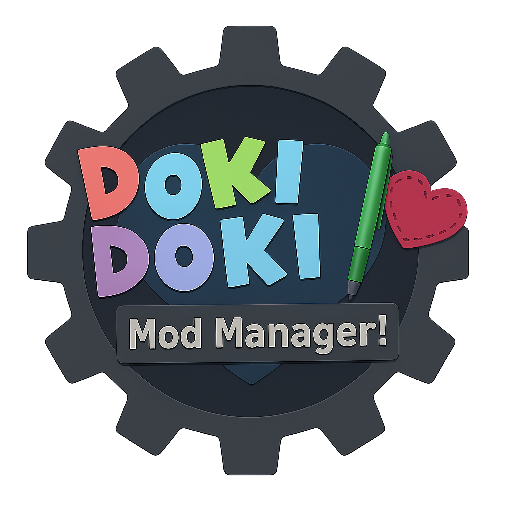

<div align="center">
  
  
  
  # 🎀 Doki Doki Mod Manager 🎀
  
  <h3>✨ The ultimate mod manager for Doki Doki Literature Club! ✨</h3>
  
  <p>
    <a href="https://github.com/Dynamicaaa/Mod-Manager/releases">
      
    </a>
    <a href="LICENSE">
      
    </a>
  </p>
  
  <p>
    <a href="https://github.com/Dynamicaaa/Mod-Manager/releases">
      
    </a>
    <a href="https://discord.gg/ktd9NR2XA2">
      
    </a>
  </p>
  
  <p>
    <a href="https://github.com/Dynamicaaa/Mod-Manager/stargazers">
      
    </a>
    <a href="https://github.com/Dynamicaaa/Mod-Manager/forks">
      
    </a>
  </p>
  
  <br>
  
  <h4>🌟 Modern, feature-rich mod management with integrated Sayonika store support 🌟</h4>
  
  <br>
  
  <p><strong>👨‍💻 Maintainer:</strong> <a href="https://github.com/Dynamicaaa">Dynamicaaa</a></p>
  
  <br>
  
  <p align="center">
    
    <br>
    
  </p>
</div>

<div align="center">

## ✨ Features

<br>

</div>

<p align="center">
  <table>
    <tr>
      <td style="text-align: center; padding: 12px; border: 1px solid #ddd; vertical-align: top;">
        <h3>🌟 <b>Core Features</b></h3>
        <ul align="left">
          <li>🎯 <b>Integrated Sayonika Store</b> - Browse and download mods directly</li>
          <li>📦 <b>Smart Mod Management</b> - Install, organize, and launch with ease</li>
          <li>🔐 <b>Multiple Authentication</b> - GitHub or email/password login</li>
          <li>🖥️ <b>Cross-Platform Support</b> - Windows, macOS, and Linux</li>
          <li>🎨 <b>Modern Interface</b> - Clean, responsive DDLC-themed design</li>
        </ul>
      </td>
      <td style="text-align: center; padding: 12px; border: 1px solid #ddd; vertical-align: top;">
        <h3>🚀 <b>Advanced Features</b></h3>
        <ul align="left">
          <li>🔍 <b>Powerful Search</b> - Find mods quickly with filters</li>
          <li>⭐ <b>Ratings & Reviews</b> - Community-driven mod discovery</li>
          <li>🏷️ <b>Category Filtering</b> - Browse by genre and tags</li>
          <li>📱 <b>One-Click Install</b> - Seamless mod installation</li>
          <li>👤 <b>User Profiles</b> - Personalized mod collections</li>
        </ul>
      </td>
    </tr>
  </table>
</p>

<div align="center">

---

</div>

<div align="center">

## 🤔 Why This Mod Manager?

</div>

<div align="center">

### 📉 **The State of DDLC Mod Management**

</div>

The original [**Doki Doki Mod Manager by proudust**](https://github.com/proudust/ddmm) was once the go-to solution for managing DDLC mods. However, it has been **abandoned and is no longer maintained**. Over time, the original DDMM has developed several critical issues:

<div align="center">

| ❌ **Issues with Original DDMM** |
|:--------------------------------:|
| **Broken functionality** due to outdated dependencies and security vulnerabilities |
| **No support for modern DDLC mods** and newer mod formats |
| **Compatibility issues** with current operating systems |
| **Lack of updates** since the project was abandoned by its maintainer |
| **Security risks** from unpatched vulnerabilities in its outdated codebase |

</div>

<div align="center">

### 🆚 **Why Not Doki Doki Mod Docker?**

</div>

While [Doki Doki Mod Docker](https://github.com/Bronya-Rand/DDModDocker) exists as an alternative, this Doki Doki Mod Manager offers significant advantages:

<div align="center">

<p align="center">
  <table>
    <tr>
      <th style="text-align: center; padding: 12px; border: 1px solid #ddd; background-color: #f8f9fa; font-weight: bold;">🏆 <strong>This Mod Manager</strong></th>
      <th style="text-align: center; padding: 12px; border: 1px solid #ddd; background-color: #f8f9fa; font-weight: bold;">🐳 <strong>Docker Version</strong></th>
    </tr>
    <tr>
      <td style="text-align: center; padding: 12px; border: 1px solid #ddd;">✅ <strong>Native Performance</strong><br/><em>Runs directly on your system</em></td>
      <td style="text-align: center; padding: 12px; border: 1px solid #ddd;">❌ <strong>Containerization Overhead</strong><br/><em>Slower due to Docker layers</em></td>
    </tr>
    <tr>
      <td style="text-align: center; padding: 12px; border: 1px solid #ddd;">✅ <strong>Simple Installation</strong><br/><em>Download and run executable</em></td>
      <td style="text-align: center; padding: 12px; border: 1px solid #ddd;">❌ <strong>Complex Setup</strong><br/><em>Requires Docker knowledge</em></td>
    </tr>
    <tr>
      <td style="text-align: center; padding: 12px; border: 1px solid #ddd;">✅ <strong>OS Integration</strong><br/><em>File associations & shortcuts</em></td>
      <td style="text-align: center; padding: 12px; border: 1px solid #ddd;">❌ <strong>Limited Integration</strong><br/><em>Isolated container environment</em></td>
    </tr>
    <tr>
      <td style="text-align: center; padding: 12px; border: 1px solid #ddd;">✅ <strong>Low Resource Usage</strong><br/><em>Minimal system impact</em></td>
      <td style="text-align: center; padding: 12px; border: 1px solid #ddd;">❌ <strong>High Overhead</strong><br/><em>Docker daemon always running</em></td>
    </tr>
    <tr>
      <td style="text-align: center; padding: 12px; border: 1px solid #ddd;">✅ <strong>Sayonika Store Built-in</strong><br/><em>Integrated mod browsing</em></td>
      <td style="text-align: center; padding: 12px; border: 1px solid #ddd;">❌ <strong>No Store Integration</strong><br/><em>Manual mod sourcing</em></td>
    </tr>
    <tr>
      <td style="text-align: center; padding: 12px; border: 1px solid #ddd;">✅ <strong>Active Development</strong><br/><em>Regular updates & features</em></td>
      <td style="text-align: center; padding: 12px; border: 1px solid #ddd;">❌ <strong>Limited Updates</strong><br/><em>Slower development cycle</em></td>
    </tr>
  </table>
</p>

<br>

> 💡 **This version combines the best aspects of the original DDMM concept with modern development practices, active maintenance, and enhanced features that make mod management effortless.**

</div>

<div align="center">

---

## 📥 Download

<br>

### 🚀 **Get Started Now!**

<br>

<p>
<a href="https://github.com/Dynamicaaa/Mod-Manager/releases">

</a>
</p>

<p>
<a href="https://github.com/Dynamicaaa/Mod-Manager/releases">

</a>
</p>

<p>
<a href="https://github.com/Dynamicaaa/Mod-Manager/releases">

</a>
</p>

<br>

---

<h3>📦 <a href="https://github.com/Dynamicaaa/Mod-Manager/releases">View All Releases</a></h3>

<br>

</div>

<div align="center">

---

## 🌐 Sayonika Integration

<br>

This version of DDMM includes **full integration** with the Sayonika mod store at [**sayonika.dynamicaaa.me**](https://sayonika.dynamicaaa.me)

<br>

</div>

<p align="center">
  <table>
    <tr>
      <td style="text-align: center; padding: 12px; border: 1px solid #ddd; vertical-align: top;">
        <h3>🎯 <b>Discovery Features</b></h3>
        <ul align="left">
          <li>🔍 <b>Browse & Search</b> - Thousands of DDLC mods at your fingertips</li>
          <li>📊 <b>Trending Mods</b> - Discover what's popular in the community</li>
          <li>🏷️ <b>Smart Filtering</b> - Find mods by category, tags, and popularity</li>
        </ul>
      </td>
      <td style="text-align: center; padding: 12px; border: 1px solid #ddd; vertical-align: top;">
        <h3>⚡ <b>User Features</b></h3>
        <ul align="left">
          <li>⚡ <b>One-Click Downloads</b> - Instant mod installation</li>
          <li>👤 <b>User Authentication</b> - Personalized profiles and collections</li>
          <li>⭐ <b>Community Reviews</b> - Ratings and feedback from players</li>
        </ul>
      </td>
    </tr>
  </table>
</p>

<div align="center">

---

## 🛠️ Development

<br>

### **Run from Source**

</div>

We strongly recommend using [**Bun**](https://bun.sh) as your JavaScript runtime for development.

<div align="center">

#### 🚀 **Why Bun?**

</div>

<table align="center">
<tr>
<td align="center">

**⚡ Superior Performance**
*Up to 3x faster than Node.js*

</td>
<td align="center">

**📦 Built-in Package Manager**
*No need for separate npm*

</td>
</tr>
<tr>
<td align="center">

**🔷 TypeScript Support**
*First-class support out of the box*

</td>
<td align="center">

**🔥 Enhanced Development**
*Hot reloading & better performance*

</td>
</tr>
</table>

<div align="center">

*While Node.js is still supported, Bun provides the best development experience.*

<br>

</div>

```bash
# Clone the repository
git clone https://github.com/Dynamicaaa/Mod-Manager
cd Mod-Manager

# Install dependencies
bun install

# Start development server
bun run start
```

<div align="center">

### **CSS Development**

</div>

DDMM uses SCSS for modern styling with automatic compilation:

```bash
# 🔨 Build Commands
bun run build-css        # Build once (development)
bun run build-css-prod   # Build for production (compressed)
bun run build-css-watch  # Watch for changes and auto-rebuild

# 🎛️ Direct Utility Usage
bun rebuild-css.js                # Standard build
bun rebuild-css.js --production   # Production build
bun rebuild-css.js --watch        # Watch mode
```

---
<div align="center">

<h2>🛠️ Migration/Update Steps</h2>

<blockquote>
  <b>Note:</b> Please follow these steps to ensure a smooth upgrade from previous versions to the latest versions.
</blockquote>

<ol align="left">
  <li><b>Backup your mods and saves:</b><br>
    Before upgrading, back up your existing mods and save files from your DDLC directory.
  </li>
  <li><b>Uninstall previous versions:</b><br>
    Remove any older installations of Doki Doki Mod Manager to prevent conflicts.
  </li>
  <li><b>Install updated version:</b><br>
    Download the latest release from <a href="https://github.com/Dynamicaaa/Mod-Manager/releases">GitHub Releases</a> and install the appropriate version for your platform.
  </li>
  <li><b>Restore your mods and saves:</b><br>
    Copy your backed-up mods and save files into the new installation's DDLC directory if needed.
  </li>
  <li><b>Review new settings:</b><br>
    Open the application and review new configuration options or permissions.
  </li>
  <li><b>Check for deprecated features:</b><br>
    Some legacy features may be removed or replaced. Refer to the <a href="https://github.com/Dynamicaaa/Mod-Manager/releases/latest">release notes</a> for details.
  </li>
  <li><b>Report issues:</b><br>
    If you encounter problems, please <a href="https://github.com/Dynamicaaa/Mod-Manager/issues">open an issue</a>.
  </li>
</ol>

</div>

---
<div align="center">

**📁 CSS File Structure:**

</div>

<p align="center">
  <table>
    <tr>
      <td style="text-align: center; padding: 12px; border: 1px solid #ddd;">
        <a href="src/renderer/css/app.scss"><code>app.scss</code></a><br>
        <em>Main application styles</em>
      </td>
      <td style="text-align: center; padding: 12px; border: 1px solid #ddd;">
        <a href="src/renderer/css/fonts.scss"><code>fonts.scss</code></a><br>
        <em>Font definitions</em>
      </td>
      <td style="text-align: center; padding: 12px; border: 1px solid #ddd;">
        <a href="src/renderer/css/sayonika-store.scss"><code>sayonika-store.scss</code></a><br>
        <em>Sayonika integration styles</em>
      </td>
    </tr>
  </table>
</p>

<div align="center">

---

## 🐛 Debug Tools

<br>

Set these environment variables to enable debugging features:

<br>

</div>

<p align="center">
  <table>
    <tr>
      <th style="text-align: center; padding: 12px; border: 1px solid #ddd; background-color: #f8f9fa; font-weight: bold;">🔧 <strong>Variable</strong></th>
      <th style="text-align: center; padding: 12px; border: 1px solid #ddd; background-color: #f8f9fa; font-weight: bold;">📋 <strong>Purpose</strong></th>
    </tr>
    <tr>
      <td style="text-align: center; padding: 12px; border: 1px solid #ddd;"><code>DDMM_LANG_PROOF</code></td>
      <td style="text-align: center; padding: 12px; border: 1px solid #ddd;">🔤 Adds prefixes to all localized strings</td>
    </tr>
    <tr>
      <td style="text-align: center; padding: 12px; border: 1px solid #ddd;"><code>DDMM_DEVTOOLS</code></td>
      <td style="text-align: center; padding: 12px; border: 1px solid #ddd;">🔧 Opens developer tools on launch</td>
    </tr>
    <tr>
      <td style="text-align: center; padding: 12px; border: 1px solid #ddd;"><code>DDMM_INCOGNITO</code></td>
      <td style="text-align: center; padding: 12px; border: 1px solid #ddd;">🕶️ Removes app name from title bar</td>
    </tr>
    <tr>
      <td style="text-align: center; padding: 12px; border: 1px solid #ddd;"><code>DDMM_LANG</code></td>
      <td style="text-align: center; padding: 12px; border: 1px solid #ddd;">🌍 Sets language (see <a href="lang/"><code>lang/</code></a> folder)</td>
    </tr>
  </table>
</p>

<div align="center">

---

## 🤝 Contributing

<br>

We welcome contributions! Here's how you can help:

<br>

</div>

<p align="center">
  <table>
    <tr>
      <td style="text-align: center; padding: 12px; border: 1px solid #ddd; vertical-align: top;">
        <h3>🐛 <b>Bug Reports</b></h3>
        <ul align="left">
          <li>🔍 <b>Find Issues</b> - Help us identify problems</li>
          <li>📝 <b><a href="https://github.com/Dynamicaaa/Mod-Manager/issues/new">Create Reports</a></b> - Detailed bug descriptions</li>
        </ul>
      </td>
      <td style="text-align: center; padding: 12px; border: 1px solid #ddd; vertical-align: top;">
        <h3>💡 <b>Feature Requests</b></h3>
        <ul align="left">
          <li>🚀 <b>Suggest Features</b> - Share your creative ideas</li>
          <li>🎯 <b>Improve UX</b> - Help make the app better</li>
        </ul>
      </td>
    </tr>
    <tr>
      <td style="text-align: center; padding: 12px; border: 1px solid #ddd; vertical-align: top;">
        <h3>🔧 <b>Code Contributions</b></h3>
        <ul align="left">
          <li>📄 <b>Submit Pull Requests</b> - Help improve the codebase</li>
          <li>🧪 <b>Write Tests</b> - Ensure code quality</li>
        </ul>
      </td>
      <td style="text-align: center; padding: 12px; border: 1px solid #ddd; vertical-align: top;">
        <h3>📖 <b>Documentation</b></h3>
        <ul align="left">
          <li>✍️ <b>Improve Docs</b> - Make things clearer for everyone</li>
          <li>🌍 <b>Translations</b> - Help localize the app</li>
        </ul>
      </td>
    </tr>
  </table>
</p>

<div align="center">

---

## ⚖️ IP Guidelines

<br>

Doki Doki Mod Manager is a fan work of Doki Doki Literature Club, created in accordance with Team Salvato's [**IP Guidelines**](http://teamsalvato.com/ip-guidelines/).

<br>

---

## 📄 Licenses and Acknowledgements

<br>

**📜 Doki Doki Mod Manager** is licensed under the [**MIT License**](LICENSE)

<br>

---

<h3>✨ Made with 💖 for the DDLC modding community ✨</h3>

<br>


</div>
